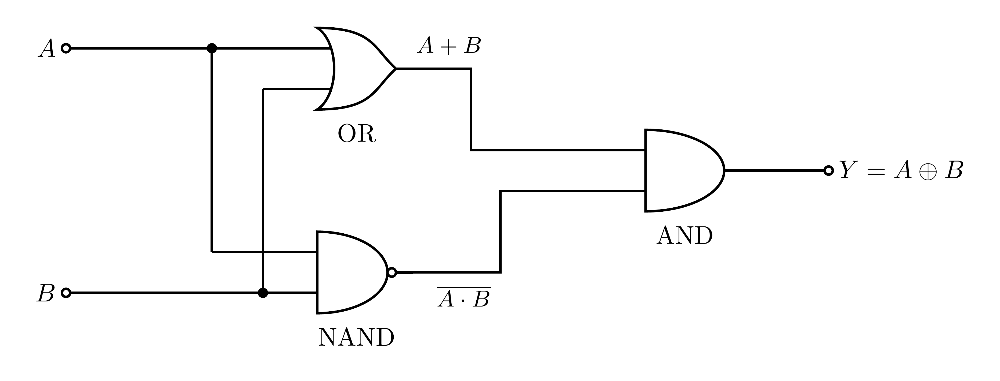
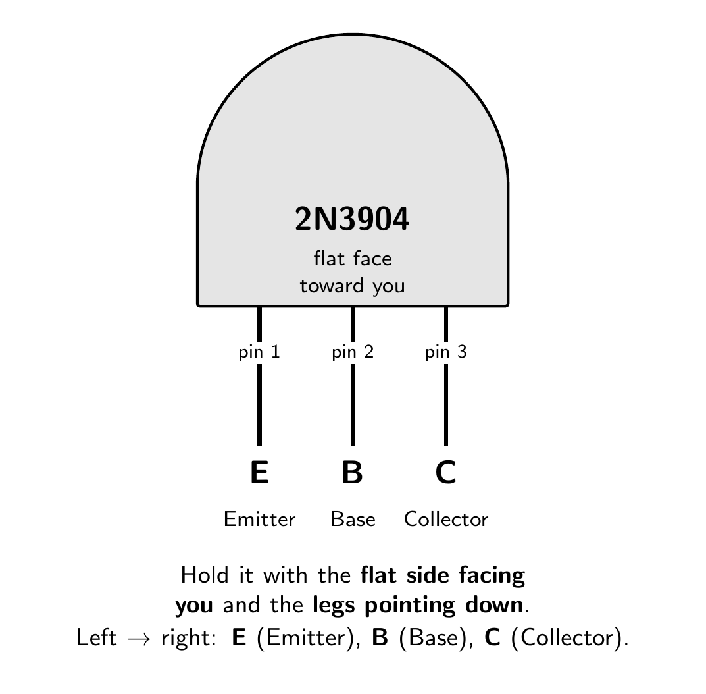
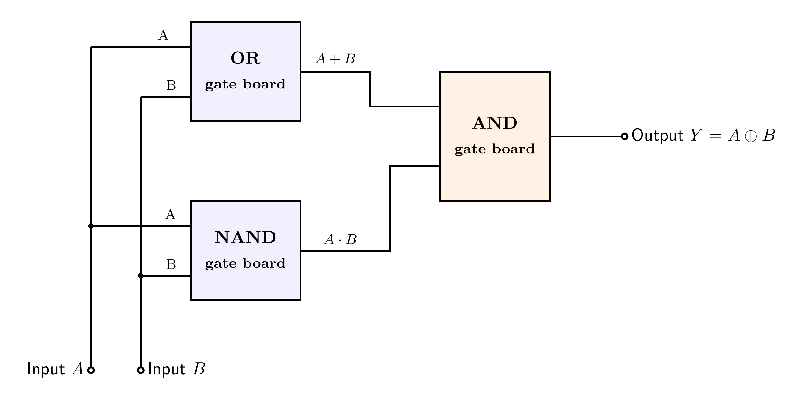

# XOR Gate (Exclusive-OR)

An XOR gate outputs `1` **when its inputs are different**, and `0` when they are the same
(`Y = A ⊕ B`).

This version is a **native complementary (CMOS-style) gate** — the standard CMOS XOR topology
built from 2N3904/2N3906 pairs, just like this project's NAND and NOR. The whole gate is
**12 transistors on two half-size (400-point) breadboards** placed side by side, with
indicator LEDs on the external inputs and output only. (It can also be wired from three
finished gate boards — see the [alternative build](#alternative-build-from-finished-gate-boards).)

### Symbol

Like an OR gate, but with an extra curved line across the inputs.


### Truth table

| `A` | `B` | `Y` |
|:---:|:---:|:---:|
| 0 | 0 | 0 |
| 0 | 1 | **1** |
| 1 | 0 | **1** |
| 1 | 1 | 0 |

`Y = A ⊕ B`  ("1 if exactly one input is 1")

---

## How it is built

This is the **standard CMOS XOR topology** in the project's BJT idiom — one single-stage
complementary gate plus two small input inverters:

> **Pull-up (2N3906):** two parallel PNP pairs **in series** — (Q5‖Q6) then (Q7‖Q8) —
> conducts when `(A+B)·(A·B)′`, i.e. exactly when **A ≠ B**, driving `Y` HIGH.
> **Pull-down (2N3904):** two series NPN stacks **in parallel** — (Q1·Q2) and (Q3·Q4) —
> conducts when `A·B + Ā·B̄`, i.e. exactly when **A = B**, driving `Y` LOW.
> **Inverters:** Q10/Q9 make `Ā`, Q12/Q11 make `B̄` on the board.


One network is always on and the other always off, so the output is **actively driven**
rail-to-rail (`~4.8 V` / `~0.2 V`) and draws almost no current at rest — same as the NAND and
NOR boards. Every transistor keeps its **own 10 kΩ base resistor** (see the NOT gate's note on
separate base resistors). Check the networks against the truth table (PNPs turn on when their
base is LOW, NPNs when it is HIGH):

| `A` | `B` | pull-up `(A+B)·(A·B)′` | pull-down `A·B + Ā·B̄` | `Y` |
|:---:|:---:|:----------------------:|:----------------------:|:---:|
| 0 | 0 | off | **on** (via Q3·Q4) | 0 |
| 0 | 1 | **on** | off | **1** |
| 1 | 0 | **on** | off | **1** |
| 1 | 1 | off | **on** (via Q1·Q2) | 0 |

### The same function from standard gates

XOR can also be composed from gates already in this project — the identity used by the
[alternative build](#alternative-build-from-finished-gate-boards):

> XOR = (A OR B) AND (A NAND B)

- `A OR B` is `1` whenever **at least one** input is high.
- `A NAND B` is `1` whenever the inputs are **not both** high.
- ANDing them gives `1` only when **exactly one** input is high, which is XOR.



Check it against the truth table:

| `A` | `B` | `A+B` | `A NAND B` | `Y = (A+B)·(A NAND B)` |
|:---:|:---:|:-----:|:----------:|:----------------------:|
| 0 | 0 | 0 | 1 | 0 |
| 0 | 1 | 1 | 1 | **1** |
| 1 | 0 | 1 | 1 | **1** |
| 1 | 1 | 1 | 0 | 0 |

---

## Building it on a breadboard

The whole XOR gate — **12 transistors** — fits on **two half-size (400-point) breadboards
placed side by side** (nothing sits on the seam; signals simply jump across it). All twelve
share the same TO-92 pinout (flat face toward you, legs down, **E B C** left to right), and
here the legs sit in **adjacent holes**:



The wiring picture below is the actual two-board build, every connection a **colour-coded
jumper** (see the legend). Each column of five holes in a bank is one node. The **top rail
pair** carries `+5 V` (outer) and `GND` (inner) for the transistor emitters; the **bottom
rail** is `GND` for the LED returns. Bridge the rails across the seam, and bridge **all GND
rails into one node**.


Connect the twelve transistors as follows (Q9–Q12 are the two inverters, Q1–Q4 the pull-down,
Q5–Q8 the pull-up):

| Transistor | E (emitter) | B (base, via its 10 kΩ) | C (collector) |
|:-----------|:------------|:------------------------|:--------------|
| **Q9 — 2N3904** (Ā inverter) | **GND** | Input `A` | node `Ā` |
| **Q10 — 2N3906** (Ā inverter) | **+5 V** | Input `A` | node `Ā` |
| **Q11 — 2N3904** (B̄ inverter) | **GND** | Input `B` | node `B̄` |
| **Q12 — 2N3906** (B̄ inverter) | **+5 V** | Input `B` | node `B̄` |
| **Q1 — 2N3904** (pull-down, top) | joined to Q2's collector (node *m₁*) | Input `A` | **Output Y** |
| **Q2 — 2N3904** (pull-down, bottom) | **GND** | Input `B` | node *m₁* |
| **Q3 — 2N3904** (pull-down, top) | joined to Q4's collector (node *m₂*) | node `Ā` | **Output Y** |
| **Q4 — 2N3904** (pull-down, bottom) | **GND** | node `B̄` | node *m₂* |
| **Q5 — 2N3906** (pull-up, group 1) | **+5 V** | Input `A` | node *u* |
| **Q6 — 2N3906** (pull-up, group 1) | **+5 V** | Input `B` | node *u* |
| **Q7 — 2N3906** (pull-up, group 2) | node *u* | node `Ā` | **Output Y** |
| **Q8 — 2N3906** (pull-up, group 2) | node *u* | node `B̄` | **Output Y** |

The internal nodes `Ā`, `B̄`, *m₁*, *m₂* and *u* are **plain jumper runs** — no LEDs. Then add
the indicators:

- **Input LEDs:** Input `A` → R_inA (220 Ω) → LED → GND; Input `B` → R_inB (220 Ω) → LED → GND.
- **Output LED:** Output `Y` → R_out (220 Ω) → LED → GND.

Quick test: Output is +5 V only when the two inputs are **different**. If it is stuck, the
usual causes are a swapped 2N3904/2N3906 (they look identical — mark them!) or a base resistor
on the wrong lane — re-check each base against the table.

---

## Alternative: build from finished gate boards

If you already have the sub-gate boards built, XOR is also **three finished boards** wired
together as `Y = (A OR B) AND (A NAND B)`:



Wire the three blocks like this:

| Block | Build guide | Inputs | Its output goes to |
|:------|:------------|:-------|:-------------------|
| **OR** | [or-gate](https://github.com/mrmhmdalmalki/or-gate) | A and B | one input of the AND block |
| **NAND** | [nand-gate](https://github.com/mrmhmdalmalki/nand-gate) | A and B | the other input of the AND block |
| **AND** | [and-gate](https://github.com/mrmhmdalmalki/and-gate) | the OR output and the NAND output | Output Y |

Feed inputs `A` and `B` to **both** of the first two blocks. All three boards share the same **+5 V** and **GND** rails. `+5 V` and `GND` are **nodes**, not physical positions, so either rail of the board can be the +5 V rail.

---

## Components

For the compact 12-transistor build:

| Part | Qty | Job |
|:-----|:---:|:----|
| 2N3904 (NPN) | 6 | pull-down network (Q1–Q4) + inverter pull-downs (Q9, Q11) |
| 2N3906 (PNP) | 6 | pull-up network (Q5–Q8) + inverter pull-ups (Q10, Q12) |
| 10 kΩ resistor | 12 | base resistors R1–R12, one per transistor |
| 220 Ω resistor | 3 | LED current limiters R_inA, R_inB, R_out |
| indicator LED | 3 | input A, input B, output state |

(The alternative three-board build uses **8 × 2N3904 + 8 × 2N3906** — OR 3+3, NAND 2+2,
AND 3+3 — each board with its own full LED set. The native build saves 4 transistors and
~6 LEDs per XOR, which adds up fast: the 8-bit adder needs **16** of these.)

### Transistors: 2N3904 (NPN) + 2N3906 (PNP)

- **Type:** a matched **complementary pair** — the 2N3904 is NPN, the 2N3906 is PNP, used in a
  CMOS-style arrangement, so the output is driven cleanly to `~4.8 V` / `~0.2 V`.
- **Package:** TO-92 (3 legs) for both. **Pinout** (flat face toward you, legs down): **E, B, C**
  (Emitter, Base, Collector), left to right — the same for both parts.
- **Key ratings:** V_CE ≈ **40 V** max, I_C ≈ **200 mA** max, current gain *hFE* ≈ **100–300**.
- **Substitutes:** BC547 (NPN) + BC557 (PNP), or 2N2222 + 2N2907 (re-check the pinout).

### Power

- One **+5 V** rail and a common **GND** (0 V) reference across both boards.

---

## Standards and references

**Gate symbol.** The distinctive-shape symbol follows the ANSI/IEEE standard for logic graphic symbols:

- IEEE Std 91-1984 and 91a-1991, *Graphic Symbols for Logic Functions* ([standards.ieee.org](https://standards.ieee.org/ieee/91_91a/241/)). The distinctive shapes originate from US MIL-STD-806; the international equivalent is IEC 60617-12.
- Free explainer: Texas Instruments, *Overview of IEEE Standard 91-1984* (PDF) ([ti.com](https://www.ti.com/lit/ml/sdyz001a/sdyz001a.pdf)).
- Symbols and truth tables overview: *Logic gate*, Wikipedia ([wikipedia.org](https://en.wikipedia.org/wiki/Logic_gate)).

**Transistor circuit.** The compact build is the standard **complementary static CMOS XOR
topology** (series/parallel dual networks plus input inverters), translated to a matched
NPN/PNP BJT pair; the alternative build combines standard gates with the identity
(A OR B) AND (A NAND B):

- *XOR gate — CMOS realization*, Wikipedia ([wikipedia.org](https://en.wikipedia.org/wiki/XOR_gate)).
- N. Weste and D. Harris, *CMOS VLSI Design: A Circuits and Systems Perspective*, Pearson (complementary static gates, XOR/XNOR).
- *CMOS*, Wikipedia ([wikipedia.org](https://en.wikipedia.org/wiki/CMOS)).
- *Logic Gates using Transistors*, Electronics Tutorials ([electronics-tutorials.ws](https://www.electronics-tutorials.ws/logic/logic-gates-using-transistors.html)).
- P. Horowitz and W. Hill, *The Art of Electronics*, 3rd ed., Cambridge University Press, 2015 (the BJT used as a switch).
- A. S. Sedra and K. C. Smith, *Microelectronic Circuits*, Oxford University Press (BJT switch and the logic NOT gate).
- T. L. Floyd, *Digital Fundamentals*, Pearson (logic-gate symbols and truth tables).

**Transistor parts.** 2N3904 NPN, onsemi datasheet ([PDF](https://www.onsemi.com/pdf/datasheet/2n3904-d.pdf)). 2N3906 PNP, onsemi datasheet ([PDF](https://www.onsemi.com/pdf/datasheet/2n3906-d.pdf)).

---

## Regenerating the diagrams

```bash
pdflatex circuit.tex
pdflatex circuit-gates.tex
pdflatex symbol.tex
pdflatex wiring.tex
pdflatex boards.tex
pdftoppm -png -r 600 circuit.pdf images/circuit               # -> images/circuit-1.png
pdftoppm -png -r 600 circuit-gates.pdf images/circuit-gates   # -> images/circuit-gates-1.png
pdftoppm -png -r 600 symbol.pdf  images/symbol                 # -> images/symbol-1.png
pdftoppm -png -r 400 wiring.pdf  images/wiring                 # -> images/wiring-1.png
pdftoppm -png -r 400 boards.pdf  images/boards                 # -> images/boards-1.png
```

> Use `pdftoppm`, not `pdftocairo`, at high DPI the Cairo backend can garble the fonts.
