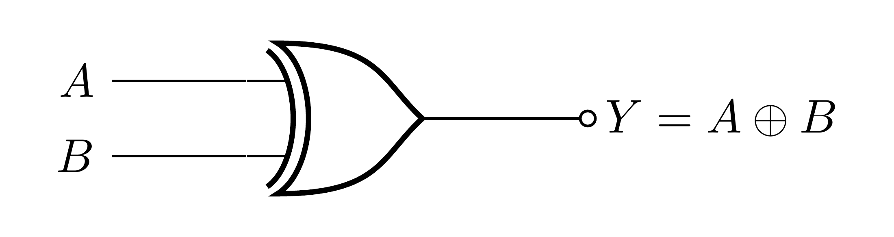
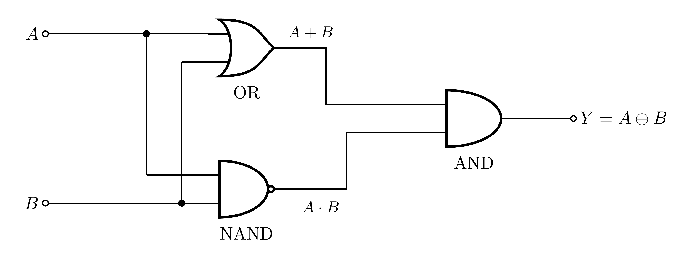

# XOR Gate (Exclusive-OR)

An XOR gate outputs `1` **when its inputs are different**, and `0` when they are the same
(`Y = A ⊕ B`).

### Symbol

Like an OR gate, but with an extra curved line across the inputs.



### Truth table

| `A` | `B` | `Y` |
|:---:|:---:|:---:|
| 0 | 0 | 0 |
| 0 | 1 | **1** |
| 1 | 0 | **1** |
| 1 | 1 | 0 |

`Y = A ⊕ B`  ("1 if exactly one input is 1")

---

## How it is built

XOR is not a single-transistor structure; it is built from simpler gates. A clean, standard
way is:

> XOR = (A OR B) AND (A NAND B)

- `A OR B` is `1` whenever **at least one** input is high.
- `A NAND B` is `1` whenever the inputs are **not both** high.
- ANDing them gives `1` only when **exactly one** input is high, which is XOR.



Check it against the truth table:

| `A` | `B` | `A+B` | `A NAND B` | `Y = (A+B)·(A NAND B)` |
|:---:|:---:|:-----:|:----------:|:----------------------:|
| 0 | 0 | 0 | 1 | 0 |
| 0 | 1 | 1 | 1 | **1** |
| 1 | 0 | 1 | 1 | **1** |
| 1 | 1 | 1 | 0 | 0 |

---

## Building it physically

Each block is a transistor circuit already documented in this project:

- **OR** → see [`or-gate`](https://github.com/mrmhmdalmalki/or-gate)
- **NAND** → see [`nand-gate`](https://github.com/mrmhmdalmalki/nand-gate)
- **AND** → see [`and-gate`](https://github.com/mrmhmdalmalki/and-gate)

Wire the two inputs `A` and `B` to **both** the OR and the NAND block, then feed those two
outputs into the AND block. The AND block's output is `Y`. All blocks share the same `+5 V`
and `GND` rails. (`0` on any wire means it is tied to **ground**; `1` means tied to **+5 V**.)

---

## Components

XOR has no single-transistor form; it is made of three sub-gate blocks, each already
documented (and built from transistors) in this project:

| Block | Folder | Transistors |
|:------|:-------|:-----------:|
| OR   | [`or-gate`](https://github.com/mrmhmdalmalki/or-gate)     | 3 × 2N3904 |
| NAND | [`nand-gate`](https://github.com/mrmhmdalmalki/nand-gate) | 2 × 2N3904 |
| AND  | [`and-gate`](https://github.com/mrmhmdalmalki/and-gate)   | 3 × 2N3904 |

**Total: 8 × 2N3904**, plus their base/collector resistors. Every transistor is the same part:

### Transistor: 2N3904

- **Type:** **NPN** *bipolar junction transistor* (BJT), a current-controlled switch used
  fully on/off.
- **Package:** TO-92 (3 legs). **Pinout** (flat face toward you, legs down): **E, B, C**
  (Emitter, Base, Collector), left to right.
- **Key ratings:** V_CE ≈ **40 V** max, I_C ≈ **200 mA** max, current gain *hFE* ≈ **100–300**.
- **Why NPN?** Every stage has its emitter at **ground**, so a HIGH (+5 V) on a base turns the
  transistor on and pulls its output toward ground. **Substitutes:** 2N2222, BC547 (re-check
  the pinout).

### Resistors

- **10 kΩ** base resistors and **1 kΩ** collector pull-ups inside each block; see the
  individual sub-gate folders for the exact placement.

### Power

- One shared **+5 V** rail and a common **GND** for all three blocks.

---

## Standards and references

**Gate symbol.** The distinctive-shape symbol follows the ANSI/IEEE standard for logic graphic symbols:

- IEEE Std 91-1984 and 91a-1991, *Graphic Symbols for Logic Functions* ([standards.ieee.org](https://standards.ieee.org/ieee/91_91a/241/)). The distinctive shapes originate from US MIL-STD-806; the international equivalent is IEC 60617-12.
- Free explainer: Texas Instruments, *Overview of IEEE Standard 91-1984* (PDF) ([ti.com](https://www.ti.com/lit/ml/sdyz001a/sdyz001a.pdf)).
- Symbols and truth tables overview: *Logic gate*, Wikipedia ([wikipedia.org](https://en.wikipedia.org/wiki/Logic_gate)).

**Transistor circuit.** This XOR is built by combining standard gates with the identity (A OR B) AND (A NAND B). Each block is a transistor gate from this project, and each follows standard transistor switch logic (series = AND, parallel = OR) / RTL:

- *Resistor-Transistor Logic (RTL)*, Wikipedia ([wikipedia.org](https://en.wikipedia.org/wiki/Resistor%E2%80%93transistor_logic)).
- *NOR and NAND gates using transistor*, TheoryCircuit ([theorycircuit.com](https://theorycircuit.com/digital-electronics/nor-and-nand-gates-using-transistor/)).
- *Logic Gates using Transistors*, Electronics Tutorials ([electronics-tutorials.ws](https://www.electronics-tutorials.ws/logic/logic-gates-using-transistors.html)).
- P. Horowitz and W. Hill, *The Art of Electronics*, 3rd ed., Cambridge University Press, 2015 (the BJT used as a switch).
- A. S. Sedra and K. C. Smith, *Microelectronic Circuits*, Oxford University Press (BJT switch and the logic inverter).
- T. L. Floyd, *Digital Fundamentals*, Pearson (logic-gate symbols and truth tables).

**Transistor part.** 2N3904 NPN, onsemi datasheet ([PDF](https://www.onsemi.com/pdf/datasheet/2n3904-d.pdf)), product page ([onsemi.com](https://www.onsemi.com/products/discrete-power-modules/general-purpose-and-low-vcesat-transistors/2n3904)).

**Highlighted source (additional).** The exact building block this design uses, scroll-to-text highlighted on the Wikipedia RTL page: [“a common-emitter stage with a base resistor”](https://en.wikipedia.org/wiki/Resistor%E2%80%93transistor_logic#:~:text=common-emitter%20stage%20with%20a%20base%20resistor).

---

## Regenerating the diagrams

```bash
pdflatex circuit.tex
pdflatex symbol.tex
pdftoppm -png -r 600 circuit.pdf images/circuit   # -> images/circuit-1.png
pdftoppm -png -r 600 symbol.pdf  images/symbol     # -> images/symbol-1.png
```

> Use `pdftoppm`, not `pdftocairo`, at high DPI the Cairo backend can garble the fonts.
